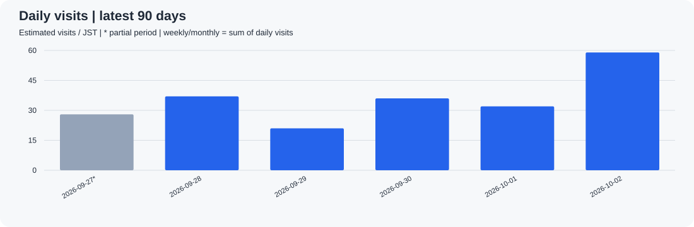
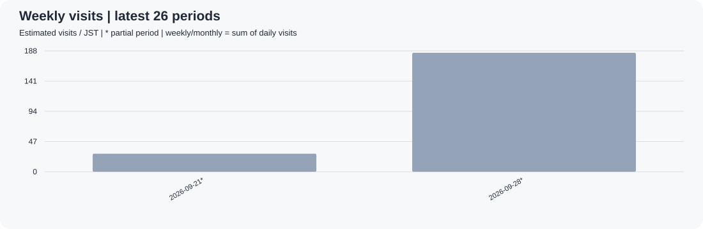
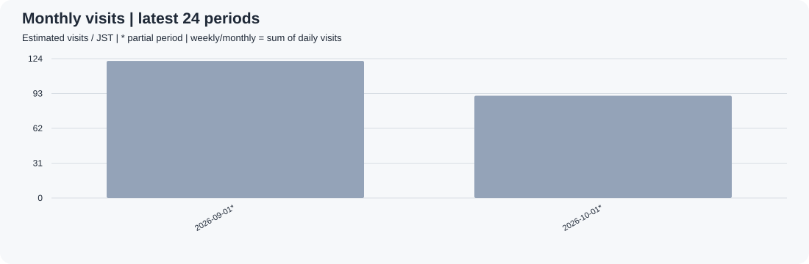
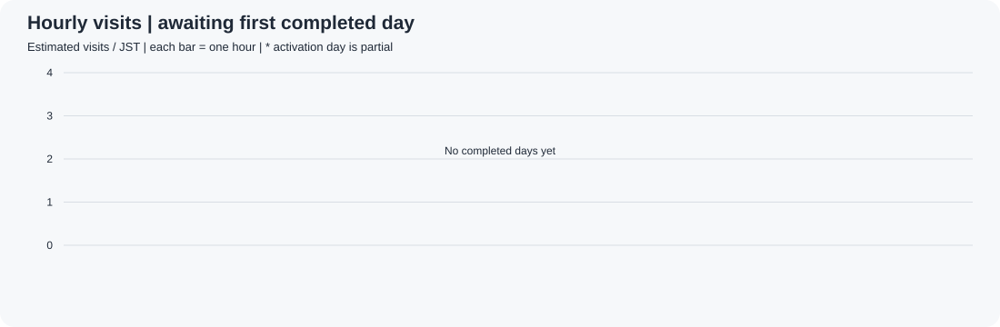
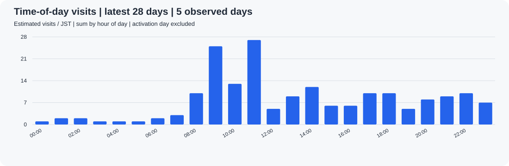
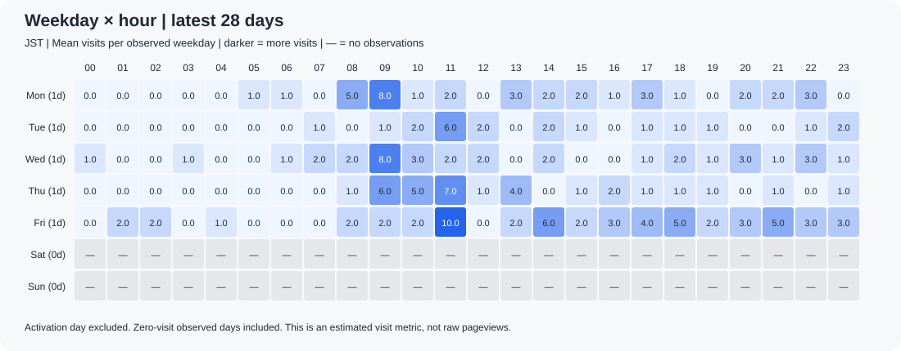

# i2lab 訪問数ログ

対象: https://minorunakazawa.github.io/i2lab/ の共通レイアウトを使うページ。集計済み: **2026-09-29**（日本時間）。
計測開始日: 2026-09-27。毎日06:17 JSTに前日までを更新予定（Actionsの遅延あり）。

訪問数はGoatCounterのセッションに基づく推定値です。同一セッションのサイト内移動・再読み込みをまとめます。
週・月は日別訪問数の延べ合計で、期間を通した実人数ではありません。開始日と、それを含む週・月、進行中の期間は不完全（*）です。
JavaScript無効・広告ブロック等は計測できません。導入前のアクセスは復元できません。

## 日毎

## 週毎（月曜〜日曜）

## 月毎（暦月）

## CSVと履歴

- [日別CSV](data/daily.csv) / [週別CSV](data/weekly.csv) / [月別CSV](data/monthly.csv)
- [日時別CSV](data/hourly.csv) / [時間帯別CSV](data/hourly-profile.csv) / [曜日×時間帯CSV](data/weekday-hourly.csv)
- [更新履歴](https://github.com/MinoruNakazawa/i2lab/commits/analytics/)
- [自動実行ログ](https://github.com/MinoruNakazawa/i2lab/actions/workflows/site-analytics.yml)

CSVは全期間を保持し、グラフは直近90日・26週・24か月を表示します。
API取得失敗は0件として記録せず、更新を失敗させます。直近7日を再取得し、欠測日も補完します。
このブランチには日付と集計値のみを保存し、IP・セッションID・閲覧URLなどの個別ログは保存しません。
公開リポジトリのため集計値は公開されます。サイト本体には表示しません。

## 時間毎（日本時間）

直近の集計済み日の0〜23時の訪問数です。開始日は部分日です。

## 時間帯別の傾向（直近28日）

日別CSVの最終日を基準とする直近28日間の、各時間帯の延べ訪問数です。
途中から計測した開始日は、時間帯の比較と下の平均から除外します。
日時別CSVには開始日も残します。0件の日も観測日数に含めます。

## 曜日×時間帯の傾向（直近28日）

各曜日の観測日数で割った「1日あたりの平均訪問数」です。未観測は「—」、観測済みの0件は「0.0」です。
同一セッションの再訪問が毎時間数え直されるわけではなく、既存の推定訪問数を発生した時間帯に分けたものです。
毎朝の更新で前日までを表示します（リアルタイム更新ではありません）。

