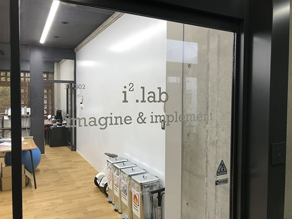

# 中沢研究室

## 指導教員による中沢研究室の定義
- 自由奔放な発想をまるで魔法のように、現実のプロダクツとする。企業との共同研究も行いつつも、独自の路線を常に持っている研究室。主たる内容はさまざまですが、基盤産業や既存業界を情報科学/コンピュータネットワーク/機械学習で変革させる事を主眼に置いています。
- 情報科学を中心とした教員に加えて、デザインシンキング・組み込みシステムの専門的な知識とスキルを有する教員やRITをはじめとする海外の大学とも共同して学生の指導を行っている事が特徴です。

## 概要
- 場所：金沢工業大学扇ヶ丘キャンパス 
  - 31号館202
  - 31号館204
  - (注意事項)
     - *許可学生のみしか入館できない場所*ですので，直接来室の場合は*事前に連絡必要*

- 見学・相談可能時刻
  - 研究室配属用の`期間終了`しましたが，全学年に対して希望する場合は個別に連絡頂ければ対応します．
  - 原則，中沢が対応できる時のみとなりますので，都合が合わない場合はお断りすることもあります．
  - nakazawa@infor.kanazawa-it.ac.jp までご連絡ください．

## 主な研究内容
- 脳活動を用いたHMI(ヒューマンマシンインタフェース)に関する研究
- 画像認識・音声認識を用いた行動理解に関する研究
- ネットワークとセキュリティに関する研究
- 多くの研究は，*学生と一緒にテーマを考えていく事を基本としています*

## 3年生へのメッセージ
- [中沢研究室の方針の説明](message.md)
- [専門ゼミで実施する事](zeminar.md)
- [大学院進学と学会発表の薦め](graduateschool.md)

## 最近の研究成果
- 研究室情報2020: [ポスター資料](midterm.md)

## 過去の研究成果(学生発表)
- [研究室Facebook](https://www.facebook.com/nakalab/)
- [以前の研究室HP](https://www.kitnet.org/laboratory/)

## メンバー
- [2020年メンバーリスト](member2020.md)

## 担当教員の授業
- 分散システム(3年前期)
- 情報工学専門実験演習A(ネットワーク演習)(3年前期後期)
- 情報工学応用(4年次前期)
- IoT特論(大学院後期)
- グローバルイノベーション統合特論(大学院夏季)

## 連絡先(コンタクト先)

- 研究室訪問をしたい人は，上記の31号館は一般学生は入館できないため，必ず以下の連絡手段を使って事前に連絡を入れてください．

- [中沢実](https://researchmap.jp/read0051201)
  - [メール](mailto:nakazawa@infor.kanazawa-it.ac.jp) nakazawa@infor.kanazawa-it.ac.jp
  - [twitter](https://twitter.com/nakazawa)
  - [Facebook](https://www.facebook.com/minoru.nakazawa.kit)
  