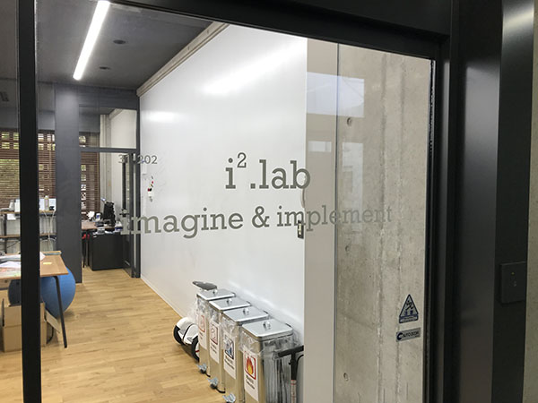

# 中沢研究室

## お知らせ
<!-- - [2021年度の4年生の発表テーマ一覧について](2021thesis_B.md) -->
- 研究室見学会実施可能日時(専門ゼミ:研究室配属)の実施について 
  - 9月26日から，平日であれば，いつでもOK(9:00-18:00 ただし外出していることもあります)。確実に捕まえる場合はメールしてください。
- 研究室配属可能人数:14名+a
- 個別に担当教員(中沢)と相談が必要な場合は、メールにてまずは連絡ください。
----
### 2024年度　研究室コンテンツ
  - [2024年度　ゼミ生の研究テーマ一覧について](2024thesis_all.md)
  - [東京ビックサイトにてJapanRobotWeekにて展示してきました．](https://www.kanazawa-it.ac.jp/kitnews/2024/0910_nakazawa.html)
    - [展示の様子-Youtube](https://youtu.be/OAVhq2khJrE)  
    - [遠距離恋愛支援システムがitmediaに掲載されました](https://www.itmedia.co.jp/aiplus/articles/2409/19/news180.html)
    - [UWB通信を用いたロボットの自己位置推定が日刊工業新聞に掲載されました](https://www.nikkan.co.jp/articles/view/00725287)
  - IWMCA2024にて，中沢研究室の修士Apirakさん，学部奥瀬さん，中沢教授が論文が再録され，口頭発表を行ってきました．
    - Apirakさんが[IWMCA2024で最優秀論文賞受賞](https://www.kanazawa-it.ac.jp/kitnews/2024/0823_iwmca2024.html)

---
### 2023年度　研究室コンテンツ

  - [2023年度　ゼミ生の研究テーマ一覧について](2023thesis_all.md)
  - [【学部4年次に取り組んだ研究が情報処理学会論文誌に採録】](https://www.kanazawa-it.ac.jp/kitnews/2024/0215_Zero-shot_Real-time_Voice_Conversion.html?_ga=2.85867999.735431080.1727136350-2011404706.1707813663)
  - [脳波を用いた痛み部位の客観的推定で90％前後の正解率](https://www.kanazawa-it.ac.jp/kitnews/2024/0202_Evaluation_of_Objective_estimation_of_Pain_location_using_EEG.html)
  - [中野君がBest Session Presentation Award受賞](https://www.kanazawa-it.ac.jp/kitnews/2024/0111_IEEE_ICCE2024.html)

<!--
## 指導教員による中沢研究室とは
- 自由奔放な発想から、魔法使いのように、未来性のあるプロダクツを創出する。企業/自治体との共同研究を行いつつも、独自の路線を常に持っている研究室。主たる内容はさまざまですが、基盤産業や既存業界を情報科学/コンピュータネットワーク/機械学習で変革させる事を主眼に置いています。
- 情報科学を中心とした教員に加えて、デザインシンキング・組み込みシステムの専門的な知識とスキルを有する教員や[RIT(ロチェスター工科大学)](https://www.rit.edu/)をはじめとする海外の大学とも共同して学生の指導を行っている事が特徴です。
-->

　
　
## 概要
- [金沢工業大学　研究室ガイド　中沢実研究室](https://kitnet.jp/laboratories/labo0067/index.html)
- 場所：金沢工業大学扇ヶ丘キャンパス 
  - 31号館202
  - 31号館204
  - (注意事項)
     - *許可学生のみしか入館できない場所*ですので，直接来室の場合は*事前に連絡必要*

- 見学・相談可能時刻
  - 相談がある場合は、nakazawa@infor.kanazawa-it.ac.jp までご連絡ください．onlineでの相談は可能です。

## 主な研究内容
- 脳活動を用いたHMI(ヒューマンマシンインタフェース)に関する研究
  - サイレント音声認識
  - 脳波を用いた感情認識
- 画像認識・音声認識を用いた行動理解に関する研究
  - 交差点における交通量調査のAI適用(カウンターラインの最適配置システム)
  - 交差点におけるアクティブカメラによる可視化領域の最適化
  - AIセンサーを活用した倉庫内での事故防止に関する
  - MR/VRを用いた自動運転システムにおける衝突検出システム
  - リザバーコンピューティングを用いた早期病変検出システム
- ネットワークとセキュリティに関する研究
  - 深層強化学習を用いた5G対応可能な動的周波数共有メカニズムの構築
  - P2P方式によるモノのアイデンティティ管理方式

- 多くの研究は，*学生と一緒にテーマを考えていく事を基本としています*

## 指導教員による中沢研究室とは
- ゼミ生が主体。あくまでも教員はそれをサポートする側。
- 教員による強いリーダーシップは存在しない。ゼミ生がラボの雰囲気を決めると思います。
- 研究に関する技術(無線ネットワーク, シミュレーション技術、各種認識技術、脳波)については教員・ゼミ生共に学ぶ。
- 基盤産業や既存業界に対して、情報科学/コンピュータネットワーク/機械学習で変革させる事を主眼に置いています。
- 企業との委託研究はそれなりにあるが、独自の研究テーマを追求したい人も相談してください。

- 2024年度の研究室体制について
  - 詳細は作成中ですのでしばらくお待ち下さい。

- 中沢研究室の対外発表(学会情報中心)
  - [ResearchMap](https://researchmap.jp/read0051201)

## 過去に学生へのメッセージ

- [中沢研究室の方針の説明](message.md)
- [専門ゼミで実施する事](zeminar.md)
- [大学院進学と学会発表の薦め](graduateschool.md)

## 最近の研究成果
- 研究室情報2022: [ポスター情報](2022thesis_all.md) (大学院生のみ)
- 研究室情報2021: [ポスター資料](midterm2021.md) ※中間発表時(2021/09/20時点)
- 研究室情報2020: [ポスター資料](midterm.md) ※中間発表時(2020/09/20時点)

## 過去の研究成果(学生発表)
- [研究室Facebook](https://www.facebook.com/nakalab/)
- [以前の研究室HP](https://www.kitnet.org/laboratory/)

## メンバー
- [2022年メンバーリスト](member2022.md)
- [2021年メンバーリスト](member2021.md)
- [2020年メンバーリスト](member2020.md)

## 担当教員の授業

- 分散システム(3年前期)
- 情報工学専門実験演習A(ネットワーク演習)(3年前期後期
- IoT特論(大学院後期)
- グローバルイノベーション統合特論(大学院夏季)

## 連絡先(コンタクト先)

- 研究室訪問をしたい人は，上記の31号館は一般学生は入館できないため，必ず以下の連絡手段を使って事前に連絡を入れてください．

- [中沢実](https://researchmap.jp/read0051201)
  - [メール](mailto:nakazawa@infor.kanazawa-it.ac.jp) nakazawa@infor.kanazawa-it.ac.jp
  - [twitter](https://twitter.com/nakazawa)
  - [Facebook](https://www.facebook.com/minoru.nakazawa.kit)
  
