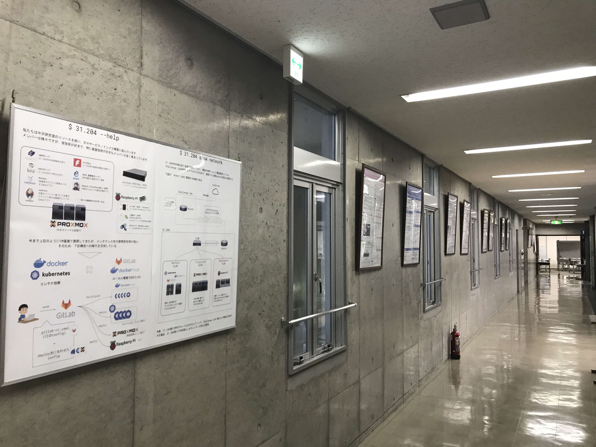

# 研究室公開情報 (2021年：中沢研究室)

##  中間発表時(2021/09/21)のポスター資料

## 研究公開資料

### 修士2年
- 本田 彰吾
- Joseph

### 修士1年
- 常田 友貴：[脳波を利用したオンライン講演の感情フィードバック](poster2021/16_eeg.pdf)

### 学部生
- 戸河 圭太：[コンテナベースIoT基盤に関する研究](poster2021/01_container_based.pdf)
- 山本 隼矢：[スナップショットの高速化手法の提案](poster2021/02_snapshot.pdf)
- 大畑 誠弥：[インターネットに依存しないLocation-based AR基盤の構築](poster2021/03_LAAR.pdf)
- 片瀬 拓海：[Unikernelを用いたバックエンド基盤の構築](poster2021/04_Unikernel.pdf)
- 嶋田 壮志：[Return-Oriented Programmingによる難読化手法の検証](poster2021/05_ROP.pdf)
- 千村 剛芳：[DOM BASED XSS対策におけるTrusted Typesの調査及び検証と構築支援手法の提案](poster2021/06_DOM_Based_Xss.pdf)
- 鈴木 大志：[AutoVCを用いたZeroshotリアルタイム音質変換](poster2021/07_AutoVC.pdf)
- 清水 聖那：[人工透析患者における血液情報を用いた治療方針決定補助ツールの構築](poster2021/08_ESA.pdf)
- 布谷 和弥：[MRを用いた清掃作業の効率化の研究](poster2021/09_MRclearn.pdf)
- 原田 武長：[P2Pで実現する本棚シェアリングWebアプリケーション](poster2021/10_P2P_Share.pdf)
- 斉藤 充輝：[ハイブリッド型オンライン会議における対面側話者の表示と字幕表示システム](poster2021/11_Hybrid_online.pdf)
- 東浦 一真：[VRセットを用いてローバーを遠隔操作する研究](poster2021/12_vr_rover.pdf)
- 安達 聡子：[遠距離恋愛支援システム：遠隔における非言語コミュニケーション手法の提案](poster2021/13_Remote_comm.pdf)
- 渡辺 魁：[交差点における深層学習を用いた交通量調査のカウンターラインの最適化手法の提案](poster2021/14_counter.pdf)
- 中野 勝章：[交差点の交通量調査におけるカメラ設置位置の信頼性の提示](poster2021/15_camera.pdf)

